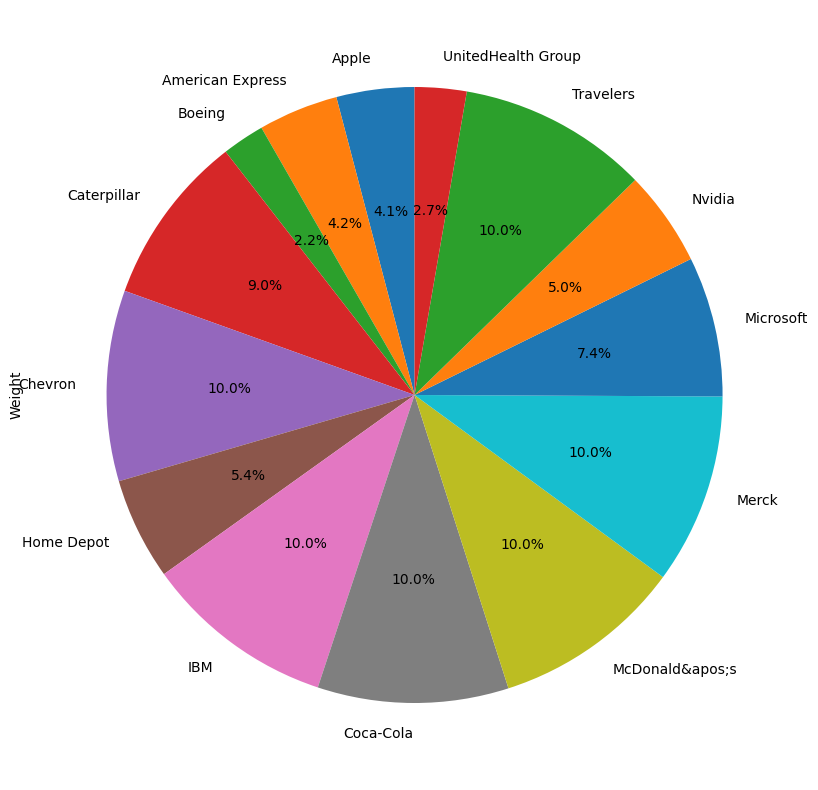
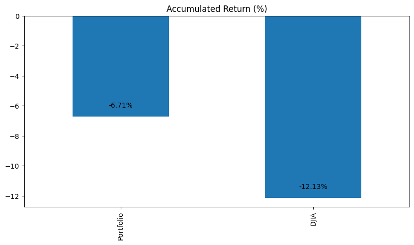
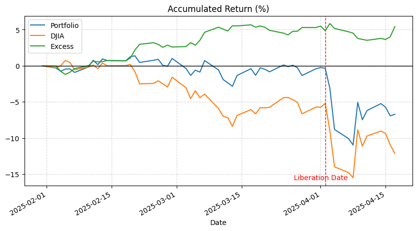
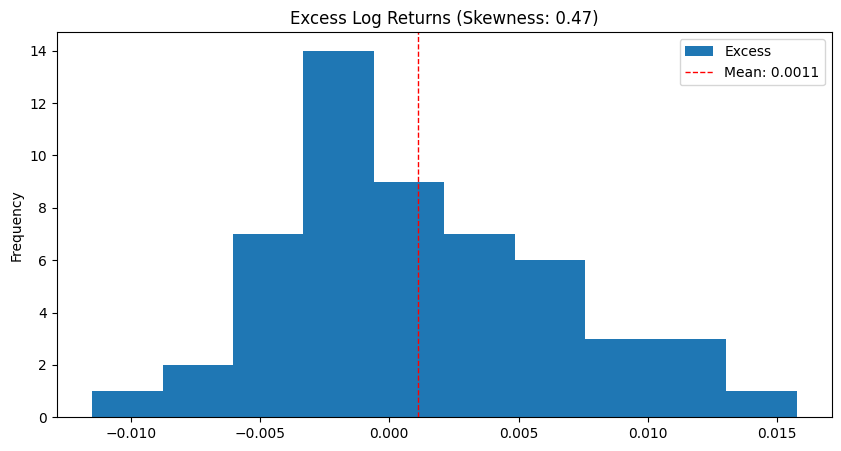
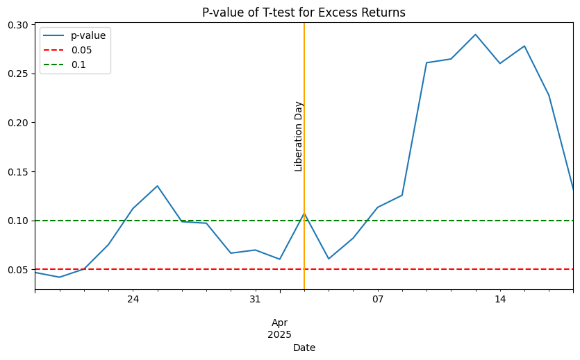

## Executive Summary

This report presents the results of our portfolio construction and backtesting based on the Dow Jones Industrial Average (DJIA) index. Our primary objective was to create an enhanced index portfolio that maintains the same or higher factor exposure as the DJIA while potentially improving returns through optimized asset allocation.

We employed a mean-variance optimization approach, utilizing the Fama-French 5 factors plus momentum to explain the returns of the DJIA index and its constituent stocks. The backtesting period spanned from January 24, 2025, to April 18, 2025, during which we tracked the performance of our portfolio against the DJIA index.

The results of our backtesting indicate that our portfolio outperformed the DJIA index during the investment period. The portfolio achieved a total return of -6.71%, while the DJIA index recorded a total return of -12.13%, resulting in an excess return of 5.42%.

The daily excess log returns of our portfolio compared to the DJIA index exhibited a positive mean of 0.0011 and a skewness of 0.47, indicating a favorable distribution of returns. A t-test conducted on the excess log returns revealed that the excess return was significant in the pre-tariff period but not in the post-tariff period.

\newpage

## Introduction and Methodology

In recent years, index investing has experienced a surge in popularity, particularly within the United States. This investment strategy, which involves creating a portfolio that mirrors the components of a financial market index, appeals to investors due to its potential for diversification, lower costs, and relatively straightforward management. Among the various indices available, the Dow Jones Industrial Average (DJIA) stands out as one of the most renowned globally. Comprising 30 major publicly traded companies in the U.S., the DJIA is often used as a barometer for the overall health of the American economy and a benchmark for investment performance.

Our primary objective in this study is to construct an enhanced index portfolio based on the DJIA. By doing so, we aim to explore the potential benefits of refining traditional index investing through innovative strategies. Two common approaches to enhancing index portfolios include active management and smart beta strategies. Active management involves making specific investments to outperform a benchmark index, while smart beta strategies focus on alternative weighting schemes to capture specific factors or market inefficiencies.

However, given our limited investment horizon (2025-01-24 to 2025-04-18), we recognize that active management may lead to high transaction costs that could erode returns. Furthermore, smart beta strategies, while promising in theory, may not consistently outperform traditional indices in the short term. To address these challenges, we employ a simple buy-and-hold strategy, utilizing a mean-variance optimized portfolio. This approach allows us to maintain the same or higher factor exposure as the DJIA while potentially enhancing returns through optimized asset allocation. 

## Portfolio Overview

### Backtesting data overview

We are using the following data for backtesting: the DJIA index, all stocks within the DJIA index, Fama-French 5 factors plus momentum [1], and weekly returns of the risk-free rate (90-day T-bill) from 2008 to 2023.

The data is collected from Wardon Research Data Services (WRDS) [2] at a daily frequency. However, we will only use weekly data for backtesting, as our trading strategy operates on a weekly basis.

We selected the period from 2008 to 2023 because it encompasses a wide range of market conditions, including the 2008 financial crisis, the COVID-19 pandemic, and the recent market recovery. This will enable us to evaluate our portfolio's performance across different market environments.

### Backtesting procedure

We conducted a backtest of our portfolio using the following steps:

1. **Factor Selection**: We tested the significance of the Fama-French 5 factors plus momentum in explaining the returns of the DJIA index and each stock within the index. This helped us identify the most relevant factors for our portfolio construction.	
2. **Rolling Mean-Variance Optimization**: We employed a rolling mean-variance optimization approach to assess the stability of our portfolio's performance. This involved re-optimizing the portfolio weights every six months to account for changes in the market environment and the performance of the selected factors.	
3. **Lookback Period Selection**: We evaluated different lookback periods for the rolling mean-variance optimization to determine the optimal duration for our portfolio construction. This helped us identify the most relevant historical data for our portfolio optimization.

### Factor selection

We used the Fama-French 5 factors plus momentum to explain the returns of the DJIA index and each stock within the index. The p-values of the regression coefficients were used to assess the significance of each factor in explaining the returns. We selected the factors with p-values less than 0.05 as significant factors for our portfolio construction.

The Fama-French 5 factors plus momentum are as follows:

- **mktrf**: Market excess return (market return minus risk-free rate)
- **smb**: Small minus big (size factor)
- **hml**: High minus low (value factor)
- **rmw**: Robust minus weak (profitability factor)
- **cma**: Conservative minus aggressive (investment factor)
- **umd**: Up minus down (momentum factor)

The p-values of the regression coefficients for the DJIA index and each stock are presented in the [Appendix 1]. And the summary of the significant factors is as follows (**Count** is the number of stocks with significant factors and **Percent** is the percentage of stocks with significant factors):

| Factor  | Count | Percent  |
|---------|-------|----------|
| mktrf   |  31   | 100.00   |
| smb     |  16   | 51.61    |
| hml     |  19   | 61.29    |
| rmw     |  20   | 64.52    |
| cma     |  21   | 67.74    |
| umd     |  11   | 35.48    |

Since the DJIA index is significantly affected by all the factors except for the momentum factor, and momentum only significantly affects 35.48% of the stocks, we decided to exclude the momentum factor from our portfolio construction.

In the upcoming mean-variance optimization, we will impose constraints to ensure that the portfolio has the same mktrf exposure as the DJIA index while maintaining higher exposure to the other factors. The goal is to preserve the same market exposure as the DJIA index while aiming for higher returns through increased exposure to the other factors.

Constraints:

- The portfolio must have the same mktrf exposure as the DJIA index.
- The portfolio must have higher exposure to the other factors (smb, hml, rmw, cma).
- The portfolio weights must sum to 1.
- The portfolio weights must be non-negative (no short selling).
- Maximum weight for each stock is 10% (to avoid concentration risk).

### Final portfolio allocation

The investment horizon for our portfolio is from January 24, 2025, to April 18, 2025. On the first trading day, we had not finalized the backtesting and optimization. We invested the entire $1,000,000 in the 90-day T-bill and earned 0.08% interest for the first week. On January 31, 2025, we allocated $1,000,800 to the final portfolio based on the mean-variance optimization results, the alloaction showed in Figure 1:

Details of the portfolio allocation are as follows:

| Company              | Industry                   | Actual Weight  (%) | Target Weight (%) | Shares | Transaction Cost ($) |
|----------------------|----------------------------|------------|-------------------|--------|------------------|
| Apple                | Information technology     | 4.08       | 4.09              | 173  | 81.66         |
| American Express     | Financial services         | 4.19       | 4.18              | 132  | 83.81         |
| Boeing               | Aerospace and defense      | 2.22       | 2.23              | 126  | 44.48         |
| Caterpillar          | Construction and mining    | 8.98       | 9.02              | 242  | 179.78        |
| Chevron              | Petroleum industry         | 9.99       | 10.00             | 670  | 199.91        |
| Home Depot           | Home Improvement           | 5.35       | 5.39              | 130  | 107.11        |
| IBM                  | Information technology     | 10.02      | 10.00             | 392  | 200.47        |
| Coca-Cola            | Drink industry             | 9.99       | 10.00             | 1576 | 200.09        |
| McDonald's           | Food industry              | 9.98       | 10.00             | 346  | 199.78        |
| Merck                | Pharmaceutical industry    | 9.97       | 10.00             | 1010 | 199.62        |
| Microsoft            | Information technology     | 7.34       | 7.36              | 177  | 146.93        |
| Nvidia               | Information technology     | 5.00       | 5.01              | 417  | 100.14        |
| Travelers            | Insurance                  | 9.97       | 10.00             | 407  | 199.58        |
| UnitedHealth Group   | Managed health care        | 2.71       | 2.73              | 50   | 54.25         |
| 13 WEEK TREASURY BILL| T-bills                    | 0.00       | 0.00              | 1.4481    | |

The following Industries have zero allocation in the final portfolio:

- Biopharmaceutical
- Broadcasting and entertainment
- Clothing industry
- Conglomerate
- Fast-moving consumer goods
- Retailing
- Speciality chemicals
- Telecommunications industry

Allocation exposure on factors:

|      | DJIA  | Portfolio | Difference |
|:-----|:-----:|:---------:|:----------:|
| mktrf| 0.957 |   0.957   |    0.000   |
| smb  | -0.103|  -0.103   |   -0.000   |
| hml  | 0.057 |   0.057   |   -0.000   |
| rmw  | 0.199 |   0.199   |    0.000   |
| cma  | 0.249 |   0.287   |    0.038   |

After optimization, we found that the portfolio has the same factor exposure as the DJIA index, except higher exposure to the cma factor. The results is consistent with our expectation that the linear programming model will likely to hit the constraints boundaries.

Interestingly, **cma** is the highest exposure factor for DJIA, also explained higheset percentage of stocks in the index. The more detailed analysis of the factor is beyond the cope of this report, but the portfolio is likely to be more sensitive to the cma factor than the DJIA index, which may lead to higher returns in the long run, consistent with our goal of enhancing the index portfolio.

\newpage

## Performance Evaluation

We tracked the performance of our portfolio from 2025-01-31 to 2025-04-18. The portfolio only had one transaction on 2025-01-31. The performace tracking is based on the **daily returns** of the portfolio and the DJIA index.

### Accumulated Returns

The total returns in the investment period of our portfolio and the DJIA index are shown in the Figure 2:

We can see that the portfolio outperformed the DJIA index during the investment period. The portfolio had a total return of -6.71%, while the DJIA index had a total return of -12.13%, outperforming the index by 5.42%. 

The daily accumulated returns in the investment period are shown in the Figure 3

We observed that the excess return gradually increased before Liberation Day (when Trump announced global tariffs) and slowly decreased during the highly volatile "tariff period." The model may perform well in a stable market. All subsequent analyses will compare the "tariff period," "non-tariff period," and "entire period."

\newpage

### Daily excess Returns and significance

The daily excess log returns of our portfolio compared to the DJIA index are shown in the Figure 4. The excess log returns are calculated as the log return of our portfolio minus the log return of the DJIA index.

It have a positive mean of 0.0011 and a skewness of 0.47, indicating that the excess log returns are positively skewed. 

We conducted a t-test to assess the significance of the excess log return of our portfolio compared to the DJIA index. The null hypothesis is that the excess return is equal to zero, while the alternative hypothesis is that the excess return is greater than zero.

\newpage

Here is the statistics of the excess log returns and the t-test results:

| Statistic    | Pre-Tariffs | Post-Tariffs | Total   |
|--------------|-------------|--------------|---------|
| Mean         | 0.0014      | 0.0009       | 0.0011  |
| Std          | 0.0049      | 0.0077       | 0.0054  |
| T-statistic  | 1.9279      | 0.3849       | 1.5325  |
| p-value      | 0.0606      | 0.7084       | 0.1315  |

With $\alpha = 0.1$, we could found the excess return is significant in the pre-tariff period, but not in the post-tariff period. The t-statistic of the total period is 1.5325, with a p-value of 0.1315, which is not significant.

We conducted a rolling t-test to assess the significance of excess log returns over time. The rolling t-test used a window from the starting date to the current date, with the first t-test beginning after 30 days of investment. The results of the rolling t-test are displayed in the Figure 5.:

We could clearly see that the p-value of the rolling t-test surged from 0.06 to near 0.30 after the tariff announcement. The model performed well in the pre-tariff period, but the performance deteriorated significantly after the tariff announcement. 

## Risk Measures

To evaluate the portfolio’s downside risk and volatility profile, we consider three key metrics: **Volatility**, **Value at Risk (VaR)**, and **Maximum Drawdown**. These measures provide insight into the behavior of the portfolio during various market conditions and allow for comparison with the benchmark index — the Dow Jones Industrial Average (DJIA). Our analysis spans three distinct market periods: pre-tariffs, post-tariffs, and the overall investment horizon.

### Volatility

Volatility is a fundamental measure of total risk and represents the standard deviation of daily log returns. It reflects the degree of variation in portfolio returns from their average. Lower volatility indicates more stable returns and a smoother investment experience.

During the pre-tariff period, the portfolio exhibited a volatility of 0.88%, significantly lower than the DJIA's 1.09%. This suggests that the portfolio was better at absorbing shocks and reducing daily fluctuations. The post-tariff period saw a rise in volatility for both the portfolio (3.10%) and the DJIA (3.41%), consistent with heightened market uncertainty. Even during this volatile phase, the portfolio managed to maintain a relative advantage. Over the entire period, the portfolio recorded a total volatility of 1.54%, compared to the DJIA's 1.72%, highlighting its overall stability.

### Value at Risk (VaR)

VaR quantifies the potential loss in portfolio value over a specified period under normal market conditions, given a confidence level. We use a parametric (Gaussian) approach to compute 1-day and 5-day VaR at both 95% and 99% confidence levels.

| Confidence | Horizon | Portfolio (Total) | DJIA (Total) |
|------------|---------|-------------------|--------------|
| 95%        | 1-Day   | -4.51%            | -2.59%       |
| 95%        | 5-Day   | -8.42%            | -5.11%       |
| 99%        | 1-Day   | -6.62%            | -3.76%       |
| 99%        | 5-Day   | -13.15%           | -7.73%       |

Although the portfolio's VaR appears larger in absolute terms, this is influenced by the higher volatility during the post-tariff period. Importantly, during the pre-tariff phase, the portfolio’s VaR was substantially lower than the DJIA’s — for instance, the 1-day 95% VaR was -1.37% for the portfolio versus -4.93% for the DJIA. This demonstrates the portfolio’s ability to minimize risk under normal market conditions.

### Maximum Drawdown

Maximum Drawdown (MDD) captures the worst-case peak-to-trough decline in portfolio value during the investment period. It reflects the magnitude of loss an investor would have experienced if they bought at the highest point and sold at the lowest.

| Period       | Portfolio | DJIA     |
|--------------|-----------|----------|
| Pre-Tariff   | -4.44%    | -9.64%   |
| Post-Tariff  | -8.09%    | -7.15%   |
| Total        | -12.18%   | -16.11%  |

The portfolio clearly outperformed the DJIA in preserving capital during the pre-tariff and overall periods. While it experienced a slightly higher drawdown post-tariffs, the cumulative drawdown across the total investment horizon remained significantly lower than the benchmark.

### Risk Measures Summary

The risk analysis reveals that the optimized portfolio consistently delivered superior risk management across various market conditions. It demonstrated:

- **Lower volatility**, suggesting more stable and predictable returns.
- **Reduced VaR**, particularly during stable market phases, reflecting stronger downside protection.
- **Shallower drawdowns**, supporting better capital preservation in adverse conditions.

These risk characteristics underline the portfolio’s effectiveness in achieving more efficient risk-adjusted performance compared to the DJIA.
